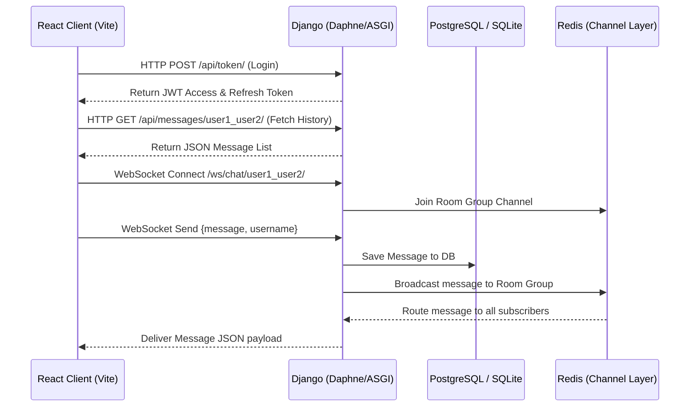

# GloChat

Welcome to **GloChat**, a real-time web chat application featuring a gorgeous neon-indigo glassmorphism frontend and a robust, scalable Django ASGI backend.

---

## 📖 User Guide

### 1. Account Creation & Sign Up
1. Open the GloChat application in your browser.
2. Select the **Register** tab.
3. Fill in your **Name**, **Username**, **Email**, and **Password**.
4. Click **Sign Up**. If successful, you will be redirected to the Login tab with a success notification.

### 2. Signing In
1. Go to the **Login** tab.
2. Enter your **Username** and **Password**.
3. Click **Sign In**. You will enter the main chat dashboard.

### 3. Chatting Real-Time
1. On the left sidebar, you will see a list of other registered users. Use the **Search bar** to quickly find a specific user by name.
2. Click on a user's name to open a direct messaging room.
3. Type your message in the text input at the bottom and click the **Send** button.
4. Messages appear instantly on both screens without page reloads.

---

## 🛠️ Developer Guide

### System Architecture & Workflows



### Module Code Structure

- **`chat/models.py`:** Defines `Profile` (extended user info), `ChatRoom` (conversation spaces), and `Message` (text logs).
- **`chat/consumers.py`:** Handles WebSocket connections, joins Channel Groups, intercepts payloads, commits text to the database, and broadcasts them.
- **`chat/routing.py`:** Binds the WebSocket route patterns to `ChatConsumer`.
- **`server/asgi.py`:** Entry point for ASGI/Daphne. Configures the routing of HTTP protocols vs WebSocket protocol.
- **`client/src/App.jsx`:** The core frontend SPA. Manages state for authentication, list filtering, dynamic WebSocket room switching, and message listing.
- **`client/src/index.css`:** The visual design system (CSS variables, glassmorphism panel blur, and neon gradients).

### Database Schema
- **`Profile` Table:** Onetoone link with Django auth `User`. Stores `name` and optional `avatar`.
- **`ChatRoom` Table:** Unique room identifiers based on sorted participant names (e.g., `user1_user2`).
- **`Message` Table:** Linked to `ChatRoom` and `User` (sender). Stores `content` and `timestamp`.

---

## 🔌 API & Protocol Specification

### 1. HTTP API Endpoints

#### User Login
- **Endpoint:** `POST /api/token/`
- **Request Body:**
  ```json
  {
    "username": "johndoe",
    "password": "securepassword"
  }
  ```
- **Response (200 OK):**
  ```json
  {
    "refresh": "JWT_REFRESH_TOKEN",
    "access": "JWT_ACCESS_TOKEN"
  }
  ```

#### User Registration
- **Endpoint:** `POST /api/register/`
- **Request Body:**
  ```json
  {
    "username": "johndoe",
    "password": "securepassword",
    "email": "johndoe@example.com",
    "name": "John Doe"
  }
  ```
- **Response (201 Created):**
  ```json
  {
    "username": "johndoe",
    "email": "johndoe@example.com"
  }
  ```

#### Current User Details
- **Endpoint:** `GET /api/me/`
- **Headers:** `Authorization: Bearer <access_token>`
- **Response (200 OK):**
  ```json
  {
    "id": 1,
    "username": "johndoe",
    "email": "johndoe@example.com",
    "profile": {
      "name": "John Doe",
      "avatar": null
    }
  }
  ```

#### Fetch Message History
- **Endpoint:** `GET /api/messages/<room_name>/`
- **Headers:** `Authorization: Bearer <access_token>`
- **Response (200 OK):**
  ```json
  [
    {
      "id": 12,
      "room": 1,
      "sender": {
        "id": 2,
        "username": "janedoe",
        "email": "jane@example.com",
        "profile": { "name": "Jane Doe", "avatar": null }
      },
      "content": "Hello John!",
      "timestamp": "2026-07-26T00:30:00Z"
    }
  ]
  ```

### 2. WebSocket Protocol
- **Connection URL:** `ws://<backend-domain>/ws/chat/<room_name>/`
- **Client to Server Message Format:**
  ```json
  {
    "message": "Hello!",
    "username": "johndoe"
  }
  ```
- **Server to Client Broadcast Format:**
  ```json
  {
    "message": "Hello!",
    "username": "johndoe",
    "timestamp": "2026-07-26T00:30:05.123456Z"
  }
  ```

---

## 🎨 UI Styling & Design Tokens
The React client utilizes custom CSS properties in `index.css` to build its dark, neon, glassmorphism theme:
- `--bg-color`: `#0d0b18` (deep space violet)
- `--panel-bg`: `rgba(22, 19, 38, 0.7)` (semi-transparent glass background)
- `--panel-border`: `rgba(139, 92, 246, 0.25)` (violet aura border)
- `--primary-color`: `#8b5cf6` (vibrant purple glow)
- `--accent-color`: `#10b981` (online status green)
- `--bubble-self`: `#4c1d95` (outgoing bubble color)
- `--bubble-other`: `#1f1b2e` (incoming bubble color)

---

## 🚀 Deployment Guide

### Backend Env Variables
Configure these in your hosting environment:
- `SECRET_KEY`: Long random string.
- `DEBUG`: `False` for production.
- `ALLOWED_HOSTS`: `<your-backend>.onrender.com`.
- `DATABASE_URL`: PostgreSQL connection string.
- `REDIS_URL`: Redis connection string (e.g., `redis://...`).
- `FRONTEND_URL`: URL of your Vercel deployment.

### Frontend Env Variables
Configure these in Vercel:
- `VITE_API_BASE`: `https://<your-backend>.onrender.com`
- `VITE_WS_BASE`: `wss://<your-backend>.onrender.com`
